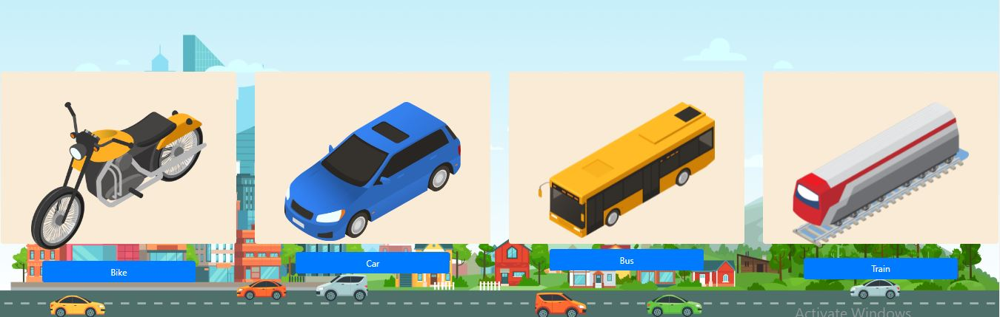
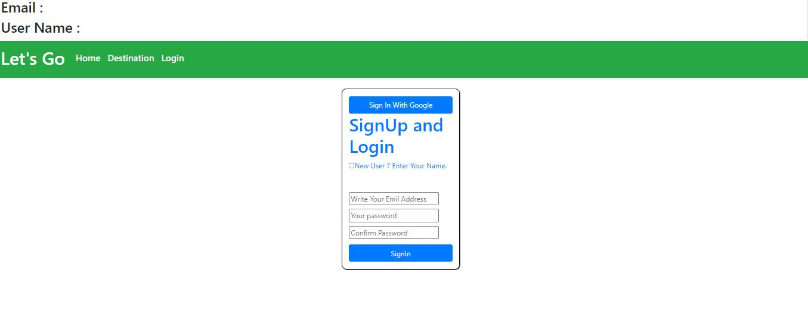

 This is a ride based . This application includes authentication for users by firebase . The whole application is conduct by react. In this application there is a home page ,in home page there are four option for user to select when user select any of the option it user we visit the destination page by some condition if the user is already logged in the application then it will go to the destination page otherwise users have to sign in the application. There are two types of verification system for user. One is google sign in other is email sign in. After sign user can visit the destination page. 
 Live Site:https://let-s-go-cc861.web.app/
 
 
 
 
